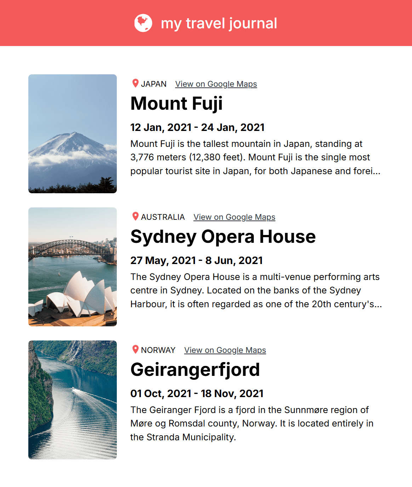

# 🗺️ My Travel Journal Project

It is a simple react mini project which demonstrates **react props.**


## 📷 Preview



## ✨ Key Takeaways

- React props.
- Mapping components.
- Spread object as props.
- Line clamps.

## 🛠️ Setup Instructions

1. **Install React with Vite**.
   ```shell
   npm create vite@latest
   npm i
   ```
2. **Clone the Repository**:
   ```bash
   git clone https://github.com/taher-dev/Learn-React-JS-FreeCodeCamp-2024.git
   ```
3. **Select Project Folder**:
   ```shell
   cd mini-project-travel-journal
   ```
4. **Run Project**:
   <br/>
   ```shell
   npm run dev
   ```
